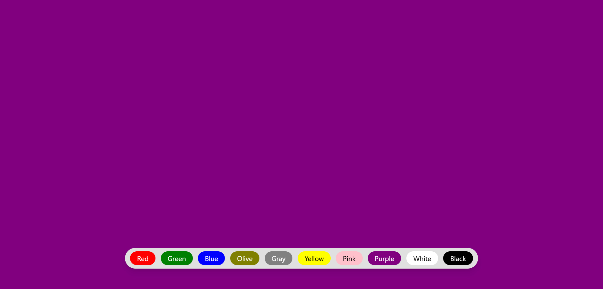

# Background Color Changer
Hi, this repository contains a Background Color Changer app built with ReactJS, HTML, and Tailwind CSS. The app allows users to change the background color by clicking different buttons, providing an interactive way to explore various color options. This project showcases the use of event handling, and Tailwind CSS for styling.

Built with:

  

## Output:

